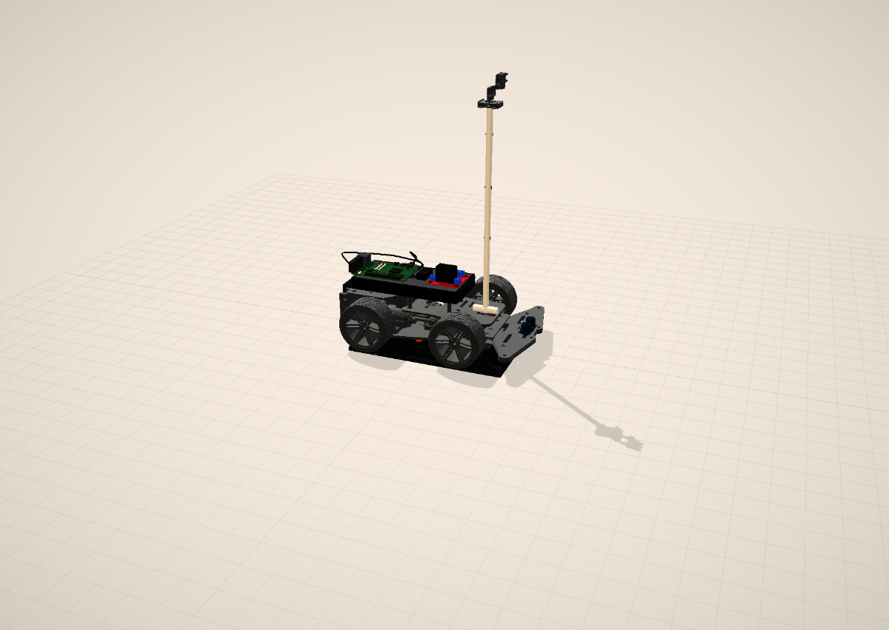
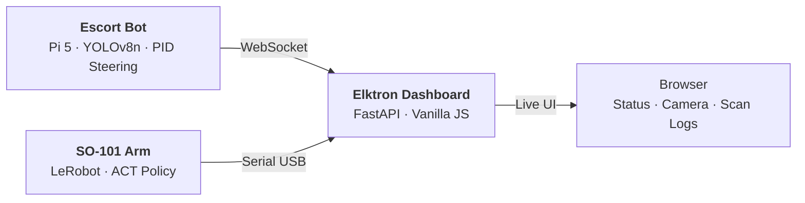

<div align="center">
  
  <h1>Elktron</h1>
  <p><strong>A robotics platform for data center operations.</strong></p>
  <p>Demonstrated through an autonomous escort bot, a robot-arm training pipeline, and a live operations dashboard.</p>
  <p>
    
    
    
    
  </p>
  <p>
    <a href="https://rpatino-cw.github.io/Elktron/"><strong>Live Site</strong></a>
  </p>
</div>

<br/>

## The Problem

Data center technicians spend hours each shift on repetitive physical work — walking alongside vendors, watching them work, manually logging rack interactions, seating optics one-by-one. These tasks are mechanical and tie up skilled engineers who should be troubleshooting, turning up racks, and solving real problems. Elktron automates the floor work so DCTs can focus on what actually moves the needle.

---

## The Live Demo — Escort Bot

<div align="center">

</div>

An autonomous 4WD robot that lives in the data hall. When a vendor enters, the bot detects them using real-time person detection, follows them through the aisles at a safe distance, and stops when they stop. If the vendor pauses at a rack, the bot runs an automated camera scan — sweeping bottom to top, capturing the state of every node before and after work is done.

No ROS. No cloud. A Raspberry Pi 5, a camera, and Python.

The tech checks in the vendor, assigns the bot, and goes back to real work.

<code>Raspberry Pi 5 · YOLOv8n · 4WD Chassis · PID Steering · Ultrasonic Obstacle Avoidance</code>

<a href="https://rpatino-cw.github.io/Elktron/escort-bot/assembly.html">

</a>
&nbsp;
<a href="https://rpatino-cw.github.io/Elktron/escort-bot/simulation.html">

</a>

---

## The Platform Extends — SO-101 Robot Arm

A robotic arm trained by demonstration to seat optics into switch ports. A technician shows the arm the task — pick up a transceiver, align it, insert it — and the arm learns to repeat the motion autonomously. No manual programming. You teach by showing.

Built on the HiWonder SO-ARM101 platform using Hugging Face's LeRobot framework. After ~50 demonstrations, the arm trains an ACT policy and runs on its own — same motion, same precision, no fatigue.

<code>SO-ARM101 · LeRobot · ACT Policy · 6-DOF Feetech Servos</code>

<a href="https://rpatino-cw.github.io/Elktron/robotics-site/so101/showcase.html">

</a>

---

## Unified Dashboard

Both robots feed into a single control panel — escort bot position, camera feeds, arm task progress, scan history. A tech sees at a glance what's running, what's done, and what needs attention without walking the floor.

<code>FastAPI · WebSocket · Vanilla JS</code>

---

## Why It's Reproducible

Every component comes with interactive 3D documentation — assembly instructions, wiring diagrams, a full DC floor simulation. The system is packaged not just as a demo, but as something another CoreWeave site could understand and build.

| Demo | What It Shows |
|------|---------------|
| [**3D Assembly Guide**](https://rpatino-cw.github.io/Elktron/escort-bot/assembly.html) | 15-step escort bot build with animated 3D models |
| [**Interactive Wiring**](https://rpatino-cw.github.io/Elktron/escort-bot/wiring-guide.html) | GPIO pin map — every connection between Pi, motor driver, sensors, and power |
| [**DC Floor Simulation**](https://rpatino-cw.github.io/Elktron/escort-bot/simulation.html) | 10-rack data hall with autonomous bot AI and collision detection |
| [**System Topology**](https://rpatino-cw.github.io/Elktron/robotics-site/topology.html) | How the escort bot, arm, and dashboard connect |

---

## Architecture



---

## Tech Stack

| Component | Stack |
|-----------|-------|
| **Escort Bot** | Raspberry Pi 5 · YOLOv8n (Ultralytics) · picamera2 · gpiozero · lgpio · PID controller · Python 3.11 |
| **SO-101 Arm** | LeRobot (HuggingFace) · ACT policy · Feetech serial bus · PyTorch · Python |
| **Dashboard** | FastAPI · WebSocket · Vanilla JS · CSS Grid |

---

## Quick Start

**Escort Bot** (on Raspberry Pi 5 — Bookworm Lite 64-bit):
```bash
cd escort-bot && chmod +x install.sh && ./install.sh
python3 main.py              # Full escort + scan mode
python3 main.py --simulate   # Test without hardware
```

**SO-101 Arm** (Mac/Linux with CUDA, MPS, or CPU):
```bash
cd robotics-site/so101 && chmod +x install.sh && ./install.sh
python record.py     # Record demos via teleoperation
python train.py      # Train ACT policy
python deploy.py     # Deploy autonomous
```

---

## Build Progress


> *YOLOv8n person detection confirmed at 78% confidence on the DC floor — March 16, 2026*

| Milestone | Status |
|-----------|--------|
| Chassis assembled (LK-COKOINO 4WD) | Done |
| L298N motor driver wired to Pi 5 GPIO | Done |
| Arducam IMX708 wide-angle camera via CSI | Done |
| YOLOv8n person detection on Pi 5 | **Working** |
| Claude Code running on Pi 5 | Done |
| Motor control + PID tuning | Next |
| Full person-following integration | Next |
| SO-101 arm assembly + training | Next |

---

<details>
<summary><strong>Hardware Cost — $430 total</strong></summary>
<br/>

| Item | Cost | Status |
|------|------|--------|
| LK-COKOINO 4WD Chassis | $25 | Assembled |
| L298N Motor Driver | $7 | Wired |
| Arducam IMX708 Wide-Angle | $60 | Connected |
| Arducam Pan-Tilt Platform | $27 | In hand |
| Raspberry Pi 5 (4GB) + Active Cooler | $70 | Running |
| HC-SR04 Ultrasonic Sensor | $9 | In hand |
| HiWonder SO-ARM101 | $270 | Ordered |
| Batteries + USB-C Power Bank | $48 | In hand |
| PVC Mast + Fittings | $15 | In hand |
| **Total** | **~$430** | |

</details>

<details>
<summary><strong>Repo Structure</strong></summary>
<br/>

```
hackathon/
├── escort-bot/              # Escort bot — brain, wiring, setup, 3D pages
│   ├── main.py              # Robot brain (373 lines — FOLLOW / SCAN / IDLE)
│   ├── pan_tilt.py           # Pan-tilt servo controller
│   ├── pid.py                # PID controller for steering
│   ├── assembly.html         # 3D assembly guide (Three.js)
│   ├── simulation.html       # DC floor simulation
│   ├── wiring-guide.html     # Interactive 3D wiring
│   ├── tests/                # Hardware test scripts
│   └── tools/                # Label printer, PDF generators
├── robotics-site/            # SO-101 arm — landing page + code
│   └── so101/                # record.py, train.py, deploy.py
├── elktron-app/              # Dashboard — FastAPI + WebSocket UI
│   └── api/server.py
├── glb/                      # 3D models (Meshy AI generated)
├── progression/              # Build progress photos
├── docs/                     # Checklists, parts list, team, philosophy
└── PROGRESS.md               # Single source of truth
```

</details>

<details>
<summary><strong>Demo Story (2:30)</strong></summary>
<br/>

1. **The Problem** (25s) — DC floor, repetitive tasks, skilled techs on autopilot
2. **Escort Bot** (75s) — Bot follows vendor through aisle, stops at rack, scans. Dashboard shows live tracking. "No ROS. No cloud. A Pi, a camera, and Python."
3. **Robot Arm** (35s) — Platform extends to optic seating. Trained by demonstration, runs autonomously. "You teach by showing."
4. **Close** (15s) — Dashboard unifies both systems. "Elktron — the data hall assistant. More. Better. Faster."

</details>

---

## Team

| Name | Role |
|------|------|
| **Romeo Patino** | Architecture, software, integration |
| **Alex Murillo** | Escort bot hardware, chassis, field testing |
| **Joshua Tapia** | SO-101 arm — CV, inverse kinematics, ACT training |
| **Parth Patel** | Dashboard backend, data integration |
| **Talha Shakil** | Demo video, pitch deck, media |
| **Raphael Rodea** | Build crew, logistics, demo day ops |

---

<div align="center">
<sub>Built in 7 days with $430 for CoreWeave "More. Better. Faster." 2026</sub>
<br/>
<sub><a href="docs/">Full documentation</a> · <a href="PROGRESS.md">Build progress</a> · <a href="https://rpatino-cw.github.io/Elktron/hub.html">Project Hub</a></sub>
</div>
