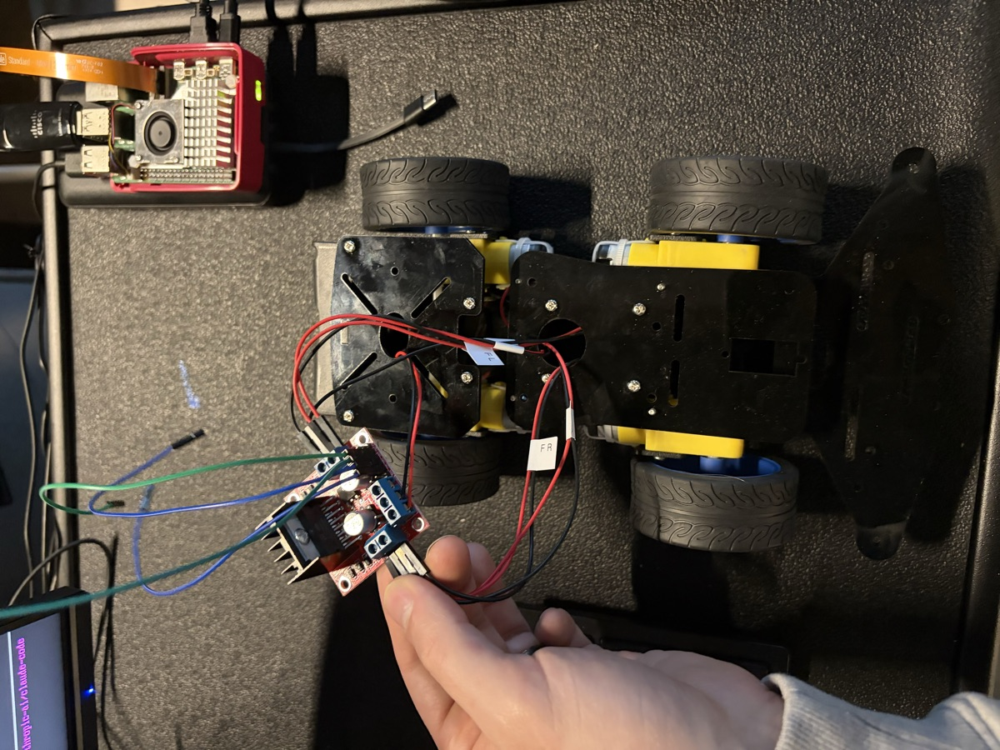
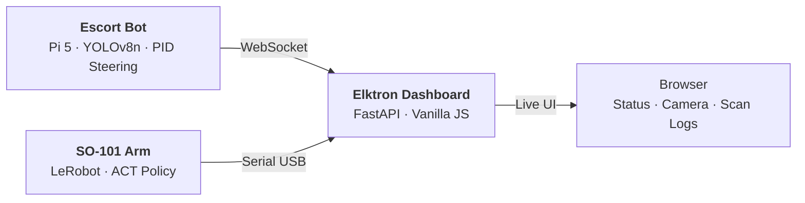
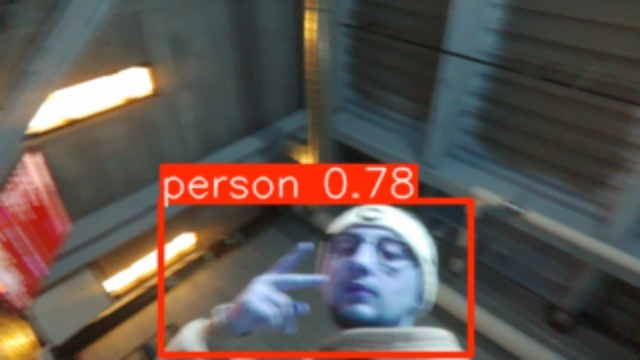

<div align="center">
  
  <h1>Elktron</h1>
  <p><strong>Two robots for the data center floor.</strong></p>
  <p>
    
    
    
    
  </p>
</div>

<br/>

## The Problem

Data center technicians spend 2+ hours per vendor escort — walking alongside contractors, watching them work, manually logging rack interactions. Optic seating is done one-by-one by hand. These tasks are mechanical, repetitive, and tie up skilled engineers who should be doing real work. Elktron automates both.

---

## The Robots

<table>
<tr>
<td align="center" width="50%">

<h3>Escort Bot</h3>
<code>Raspberry Pi 5 · YOLOv8n · 4WD Chassis</code>
<br/><br/>
Autonomously follows vendors through DC aisles using real-time person detection. Stops at racks, sweeps camera bottom-to-top, captures visual state before and after work. Full audit trail — no human escort needed.
<br/><br/>
<a href="https://rpatino-cw.github.io/Elktron/escort-bot/assembly.html">

</a>
</td>
<td align="center" width="50%">

<h3>SO-101 Arm</h3>
<code>LeRobot · ACT Policy · 6-DOF Feetech Servos</code>
<br/><br/>
Learns DC tasks through imitation — demonstrate once, it repeats autonomously. Primary use case: SFP/QSFP optic seating into switch ports. Trained via leader-follower teleoperation using HuggingFace's LeRobot framework.
<br/><br/>
<a href="https://rpatino-cw.github.io/Elktron/robotics-site/so101/showcase.html">

</a>
</td>
</tr>
</table>

---

## Interactive Demos

Every component has an interactive 3D visualization built with Three.js — explore them live:

| Demo | Description |
|------|-------------|
| [**3D Assembly Guide**](https://rpatino-cw.github.io/Elktron/escort-bot/assembly.html) | Step-by-step escort bot build with animated 3D models, GLB imports, and a software showcase terminal |
| [**DC Floor Simulation**](https://rpatino-cw.github.io/Elktron/escort-bot/simulation.html) | 10-rack hot/cold aisle layout with autonomous bot AI, collision detection, and person-following |
| [**Interactive Wiring**](https://rpatino-cw.github.io/Elktron/escort-bot/wiring-guide.html) | 3D GPIO wiring — L298N, HC-SR04 voltage divider, pan-tilt servos, power distribution |
| [**System Topology**](https://rpatino-cw.github.io/Elktron/robotics-site/topology.html) | How the arm, bot, and dashboard connect — full system architecture in 3D |

---

## Architecture



---

## Tech Stack

| Component | Stack |
|-----------|-------|
| **Escort Bot** | Raspberry Pi 5 · YOLOv8n (Ultralytics) · picamera2 · gpiozero · lgpio · PID controller · Python 3.11 |
| **SO-101 Arm** | LeRobot (HuggingFace) · ACT policy · Feetech serial bus · PyTorch · Python |
| **Dashboard** | FastAPI · WebSocket · Vanilla JS · CSS Grid |

---

## Quick Start

**Escort Bot** (on Raspberry Pi 5 — Bookworm Lite 64-bit):
```bash
cd escort-bot && chmod +x install.sh && ./install.sh
python3 main.py              # Full escort + scan mode
python3 main.py --simulate   # Test without hardware
```

**SO-101 Arm** (Mac/Linux with CUDA, MPS, or CPU):
```bash
cd robotics-site/so101 && chmod +x install.sh && ./install.sh
python record.py     # Record demos via teleoperation
python train.py      # Train ACT policy
python deploy.py     # Deploy autonomous
```

---

## Build Progress



> *YOLOv8n person detection confirmed at 78% confidence on the DC floor — March 16, 2026*

| Milestone | Status |
|-----------|--------|
| Chassis assembled (LK-COKOINO 4WD) | Done |
| L298N motor driver wired to Pi 5 GPIO | Done |
| Arducam IMX708 wide-angle camera via CSI | Done |
| YOLOv8n person detection on Pi 5 | **Working** |
| Claude Code running on Pi 5 | Done |
| Motor control + PID tuning | Next |
| Full person-following integration | Next |
| SO-101 arm assembly + training | Next |

---

<details>
<summary><strong>Hardware Cost — $430 total</strong></summary>
<br/>

| Item | Cost | Status |
|------|------|--------|
| LK-COKOINO 4WD Chassis | $25 | Assembled |
| L298N Motor Driver | $7 | Wired |
| Arducam IMX708 Wide-Angle | $60 | Connected |
| Arducam Pan-Tilt Platform | $27 | In hand |
| Raspberry Pi 5 (4GB) + Active Cooler | $70 | Running |
| HC-SR04 Ultrasonic Sensor | $9 | In hand |
| HiWonder SO-ARM101 | $270 | Ordered |
| Batteries + USB-C Power Bank | $48 | In hand |
| PVC Mast + Fittings | $15 | In hand |
| **Total** | **~$430** | |

</details>

<details>
<summary><strong>Repo Structure</strong></summary>
<br/>

```
hackathon/
├── escort-bot/              # Escort bot — brain, wiring, setup, 3D pages
│   ├── main.py              # Robot brain (327 lines — FOLLOW / SCAN / IDLE)
│   ├── pan_tilt.py           # Pan-tilt servo controller
│   ├── pid.py                # PID controller for steering
│   ├── assembly.html         # 3D assembly guide (Three.js)
│   ├── simulation.html       # DC floor simulation
│   ├── wiring-guide.html     # Interactive 3D wiring
│   ├── tests/                # Hardware test scripts
│   └── tools/                # Label printer, PDF generators
├── robotics-site/            # SO-101 arm — landing page + code
│   └── so101/                # record.py, train.py, deploy.py
├── elktron-app/              # Dashboard — FastAPI + WebSocket UI
│   └── api/server.py
├── glb/                      # 3D models (Meshy AI generated)
├── progression/              # Build progress photos
├── docs/                     # Checklists, parts list, team, philosophy
└── PROGRESS.md               # Single source of truth
```

</details>

<details>
<summary><strong>Demo Story (3 minutes)</strong></summary>
<br/>

1. **Arm** (60s) — SO-101 picks optic from tray, seats it into switch port. Dashboard shows live joint angles.
2. **Escort** (60s) — Bot follows "vendor" through aisle, stops at rack, monitors work. Dashboard shows tracking.
3. **Review** (30s) — Scan log shows vendor visits, flagged events, clean/flagged status.

</details>

---

## Team

| Name | Role |
|------|------|
| **Romeo Patino** | Architecture, software, integration |
| **Alex Murillo** | Escort bot hardware, chassis, field testing |
| **Joshua Tapia** | SO-101 arm — CV, inverse kinematics, ACT training |
| **Parth Patel** | Dashboard backend, data integration |
| **Talha Shakil** | Demo video, pitch deck, media |
| **Raphael Rodea** | Build crew, logistics, demo day ops |

---

<div align="center">
<sub>Built in 7 days with $430 for CoreWeave "More. Better. Faster." 2026</sub>
<br/>
<sub><a href="docs/">Full documentation</a> · <a href="PROGRESS.md">Build progress</a> · <a href="https://rpatino-cw.github.io/Elktron/hub.html">Project Hub</a></sub>
</div>
